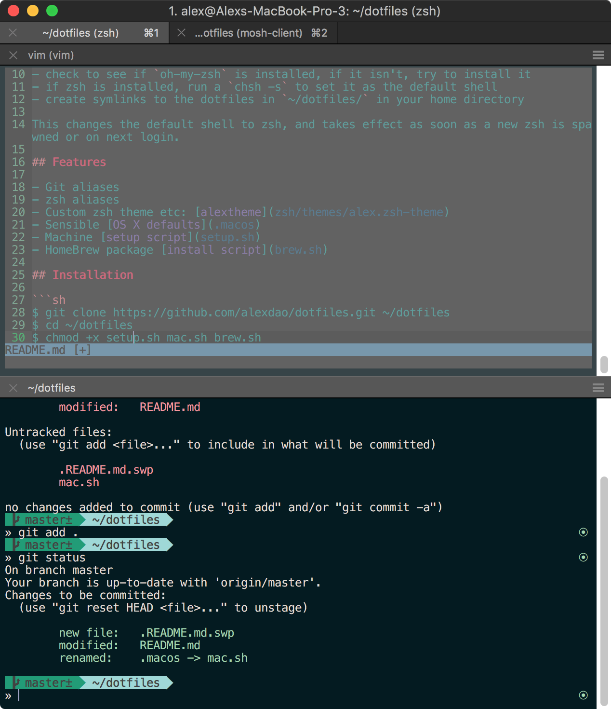

# Alex Dao's Dotfiles

This is a collection of dotfiles and scripts I use for customizing OS X and other machines to my liking and setting up the software development tools I use on a day-to-day basis. They should be cloned to your home directory so that the path is `~/dotfiles/`.  The included setup script creates symlinks from your home directory to the files which are located in `~/dotfiles/`.



I use `zsh` as my shell. The install script `setup.sh` works on OS X and Linux machines and will: 

- check to see if `zsh` is installed, if it isn't, try to install it
- check to see if `oh-my-zsh` is installed, if it isn't, try to install it
- if zsh is installed, run a `chsh -s` to set it as the default shell
- create symlinks to the dotfiles in `~/dotfiles/` in your home directory

This changes the default shell to zsh, and takes effect as soon as a new zsh is spawned or on next login.

ZSH Plugins to install:
https://github.com/zsh-users/zsh-autosuggestions

## Features

- Git aliases
- zsh aliases
- Custom zsh theme etc: [alextheme](zsh/themes/alex.zsh-theme)
- Sensible [OS X defaults](.macos)
- Machine [setup script](setup.sh)
- HomeBrew package [install script](brew.sh)

## Installation

1. Install Powerline fonts (https://gist.github.com/1595572) 

2. 
```sh
$ git clone https://github.com/alexdao/dotfiles.git ~/dotfiles
$ cd ~/dotfiles
$ chmod +x setup.sh mac.sh brew.sh
$ ./mac.sh && ./brew.sh && ./setup.sh
```

3. Import ~/dotfiles/themes/forest_itermcolors to iTerm2

## References

- [GitHub ❤ ~/](http://dotfiles.github.com/)
- [Mathias’s dotfiles](https://github.com/mathiasbynens/dotfiles)
- [Nick's dotfiles](https://github.com/nicksp/dotfiles)

## License

The code is available under the [MIT license](LICENSE). Feel free to shamelessly copy this as I have others. 
